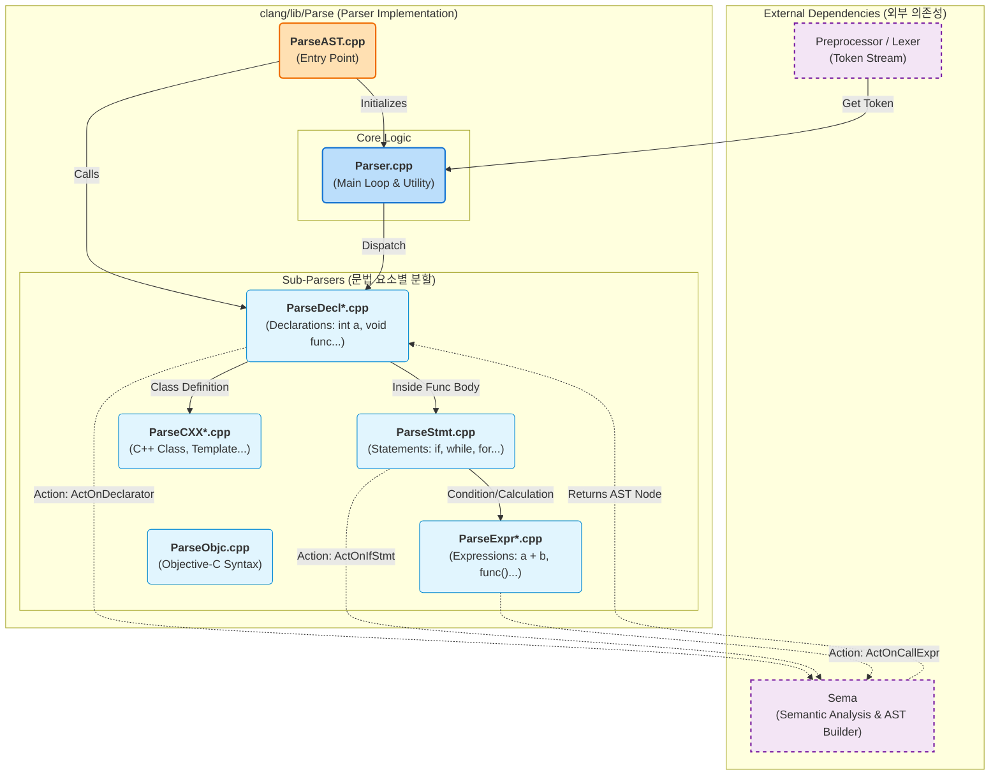

```mermaid
graph TD
    %% 스타일 정의
    classDef entry fill:#ffe0b2,stroke:#ef6c00,stroke-width:2px;
    classDef main fill:#bbdefb,stroke:#1976d2,stroke-width:2px;
    classDef components fill:#e1f5fe,stroke:#0288d1,stroke-width:1px;
    classDef external fill:#f3e5f5,stroke:#7b1fa2,stroke-width:2px,stroke-dasharray: 5 5;

    subgraph "External Dependencies (외부 의존성)"
        Lexer["Preprocessor / Lexer<br/>(Token Stream)"]:::external
        Sema["Sema<br/>(Semantic Analysis & AST Builder)"]:::external
    end

    subgraph "clang/lib/Parse (Parser Implementation)"
        Entry("<b>ParseAST.cpp</b><br/>(Entry Point)"):::entry
        
        subgraph "Core Logic"
            Parser("<b>Parser.cpp</b><br/>(Main Loop & Utility)"):::main
        end

        subgraph "Sub-Parsers (문법 요소별 분할)"
            P_Decl("<b>ParseDecl*.cpp</b><br/>(Declarations: int a, void func...)"):::components
            P_Stmt("<b>ParseStmt.cpp</b><br/>(Statements: if, while, for...)"):::components
            P_Expr("<b>ParseExpr*.cpp</b><br/>(Expressions: a + b, func()...)"):::components
            P_CXX("<b>ParseCXX*.cpp</b><br/>(C++ Class, Template...)"):::components
            P_ObjC("<b>ParseObjc.cpp</b><br/>(Objective-C Syntax)"):::components
        end
    end

    %% 연결 관계
    Lexer -->|Get Token| Parser
    Entry -->|Initializes| Parser
    Entry -->|Calls| P_Decl

    %% 파서 내부 호출 흐름 (Recursive Descent)
    Parser -->|Dispatch| P_Decl
    P_Decl -->|Inside Func Body| P_Stmt
    P_Stmt -->|Condition/Calculation| P_Expr
    P_Decl -->|Class Definition| P_CXX
    
    %% Sema와의 상호작용
    P_Decl -.->|Action: ActOnDeclarator| Sema
    P_Stmt -.->|Action: ActOnIfStmt| Sema
    P_Expr -.->|Action: ActOnCallExpr| Sema
    Sema -.->|Returns AST Node| P_Decl
```